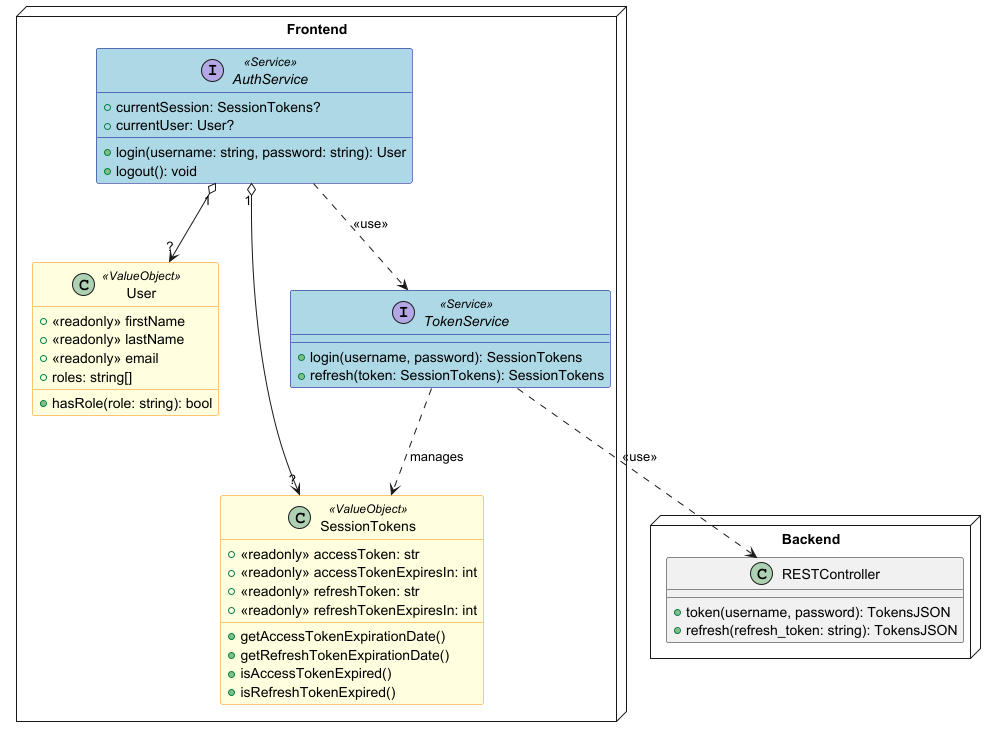

# Buch SWE Project

## Requirements

- Docker Desktop 4+
    - Docker Compose v2+
- WSL2 (Windows)
- node v22+
- npm v10+
- Git 2.23+

## Docker Compose Setup

This project uses Docker Compose to manage services such as the NestJS application, Keycloak for user authentication and authorization, and
Postgres for database management.

## Docker Compose (`docker-compose.yml`)


- **NestJS**: The core backend application.
    - Runs on port `3000`.
- **Keycloak**: For user authentication and role-based authorization.
    - Admin console enabled.
    - Runs on port `8080`.
    - Automatically imports the realm configuration from `keycloak/nest-realm.json`.
- **PostgreSQL**: Database service.
    - Runs on port `5432`.
    - Data persists via volume `postgres_data`.

With profile debug:
- **pgAdmin**: Database management tool.
    - Runs on port `8888` for web access.
    - Admin credentials are configured via environment variables.

With profile prod:
- **Angular**: The frontend application.
    - Runs on port `80`.


To Start the Angular Frontend:

## Commands

To start the application with Angular frontend:

```bash
docker compose --profile dev up --build
```


### Development
For Development its better to run the Angular frontend with npm, so that you can see the changes in real-time.

Therefore dont use the `--profile dev` flag. So that docker compose wont start the Angular frontend.
```bash
docker compose up -d --build
```

Then start the Angular frontend:

```bash
cd angular-buch-frontend
npm install
npm start
```

Visit at `http://localhost:4200` in your browser.


## Typescript Documentation

> docs/tsdoc/index.html

### UI Flow


### Component Diagram


### Auth UML Diagram

